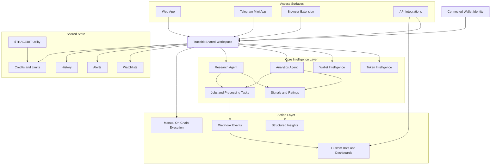

<p align="center">


<div align="center">

# Tracebit Analytics

**AI-driven crypto intelligence workspace for token analysis, wallet intelligence, agent execution, and integrated on-chain decision flows**

[](https://твоя-web-app-ссылка)
[](https://t.me/твой_мини_апп)
[](https://твои-docs-ссылка)
[](https://x.com/твой_аккаунт)
[](https://t.me/твоя_группа_или_канал)

</div>

> [!IMPORTANT]
> Tracebit is built around one shared workspace across Web App, Telegram Mini App, Browser Extension, and API integrations

> [!TIP]
> The platform is designed for fast token checks, wallet behavior analysis, agent-based research, and signal workflows without switching between disconnected tools

## The Primitive

Tracebit Analytics is an AI-native analytics layer for crypto markets

It acts as a reusable building block inside a trading or monitoring stack where token data, wallet behavior, agent execution, alerts, and credits are unified under one system

Instead of treating analytics, research, and execution as separate products, Tracebit combines them into one operational surface that can be used directly by traders or embedded into custom infrastructure by builders

| Primitive | Role inside a system |
|---|---|
| Token intelligence | Evaluates liquidity, volume, holder structure, flows, and supply behavior |
| Wallet intelligence | Profiles PnL, risk allocation, timing patterns, and behavioral consistency |
| Agents layer | Converts raw data into summaries, ratings, signals, and deeper processing tasks |
| Credits system | Controls transparent usage across scans, research, and agent runs |
| API + webhooks | Exposes Tracebit as an integration-ready intelligence backend |

## Product View

Tracebit is one workspace with multiple operational surfaces around it



> [!NOTE]
> All surfaces share the same backend, credits balance, watchlists, alerts, and agent history, so configuration happens once and carries across the full product

## Input → Output

One practical Tracebit flow looks like this

| Input | Processing | Output |
|---|---|---|
| A Solana token address | Token analytics agent gathers liquidity, volume, holder concentration, whale flows, and volatility | A structured summary with risk score, flags, and AI explanation |
| A wallet address | Wallet analytics agent evaluates PnL, win rate, position sizing, drawdowns, and behavior | A performance profile with strategy patterns and risk observations |
| A narrative request | Research agent monitors relevant news, social context, and market signals | A concise brief with impact framing and follow-up relevance |

Example

`Token address → analytics_token_v1 → risk summary, liquidity snapshot, holder structure, whale flow context, alert-ready metadata`

## Fastest Integration

The fastest integration path is to call the Agents API, run a job asynchronously, and fetch the result when it completes

> [!WARNING]
> All API access requires a scoped API key from the Tracebit dashboard and every run consumes credits based on processing depth

### Minimal working example

```ts
const BASE_URL = 'https://api.tracebit.ai/v1'

async function runTracebitTokenAnalysis(apiKey: string, address: string) {
  const runResponse = await fetch(`${BASE_URL}/agents/run`, {
    method: 'POST',
    headers: {
      'Authorization': `Bearer ${apiKey}`,
      'Content-Type': 'application/json'
    },
    body: JSON.stringify({
      agent_id: 'analytics_token_v1',
      mode: 'async',
      input: {
        chain: 'solana',
        address,
        depth: 'standard'
      },
      metadata: {
        source: 'readme-example'
      }
    })
  })

  if (!runResponse.ok) {
    throw new Error(`Run request failed with status ${runResponse.status}`)
  }

  const runData = await runResponse.json()
  const jobId = runData.job_id

  for (let attempt = 0; attempt < 20; attempt += 1) {
    const jobResponse = await fetch(`${BASE_URL}/jobs/${jobId}`, {
      headers: {
        'Authorization': `Bearer ${apiKey}`,
        'Accept': 'application/json'
      }
    })

    if (!jobResponse.ok) {
      throw new Error(`Job request failed with status ${jobResponse.status}`)
    }

    const jobData = await jobResponse.json()

    if (jobData.status === 'completed') {
      return jobData.result
    }

    if (jobData.status === 'failed') {
      throw new Error('Tracebit job failed')
    }

    await new Promise(resolve => setTimeout(resolve, 1500))
  }

  throw new Error('Timed out waiting for Tracebit job completion')
}
```

## Common Embed Paths

Tracebit is designed to fit into different integration patterns without changing the core intelligence model

| Embed path | Typical use |
|---|---|
| Backend / microservice | Central analytics service for bots, dashboards, or execution systems |
| Script / job | Scheduled research briefs, batch token checks, wallet reviews |
| Worker / queue | Asynchronous processing for heavier agent runs and webhook-driven workflows |
| App / frontend | In-app token scans, wallet profile views, and user-triggered research flows |

### Backend / microservice

A service receives input from your product, calls Tracebit, normalizes the output, and passes the result to your own internal logic

### Script / job

A scheduled script can request daily research updates, refresh tracked wallets, or store analytics snapshots in a database

### Worker / queue

Queued tasks are a natural fit for deeper analysis, retries, and event-driven flows where results land through webhooks instead of tight polling loops

### App / frontend

The frontend can trigger Tracebit jobs directly through your backend and display structured outputs such as risk scores, summaries, and alert states

## Composable Parts

Tracebit can be thought of as a set of composable modules rather than a single monolithic feature

| Module | What it does | Common pairing |
|---|---|---|
| Token Analytics | On-chain token structure and risk profile | Signals, watchlists, execution views |
| Wallet Analytics | Performance and behavior profiling | Trader discovery, portfolio review |
| Analytics Agent | Unified analysis layer | Dashboards, bots, saved workflows |
| Research Agent | Narrative and market context | Briefings, alerts, Telegram delivery |
| Jobs API | Async processing model | Queues, workers, background tasks |
| Webhooks | Real-time event delivery | Bots, automation tools, notifications |
| Credits Layer | Usage control and monetization | Plans, limits, token utility |

> [!TIP]
> The cleanest implementation pattern is to treat Tracebit as an intelligence service and keep execution, routing, and business logic on your side

## Configuration Surface

Tracebit exposes a practical surface for tuning behavior without forcing a full custom stack

| Area | What can be configured |
|---|---|
| Agent runs | `agent_id`, `mode`, `chain`, `address`, `depth`, optional metadata |
| API keys | Scope, rotation, read or execution permissions, quotas |
| Alerts | Conditions, thresholds, destinations, notification behavior |
| Webhooks | Endpoint, secret, event subscription, retry handling |
| Plans and usage | Credit allocation, limits, concurrency, access level |
| Workspace state | Watchlists, tracked wallets, saved preferences, cross-surface continuity |

Configuration can stay light for early integrations or expand into a full operational layer with alerts, saved filters, and external automation

## Production Notes

Tracebit is designed for real usage in trading and monitoring environments, so integration should be approached as production infrastructure rather than a demo utility

| Area | Notes |
|---|---|
| Transport | HTTPS with JSON request and response format |
| Authentication | Bearer API key model with scoped permissions |
| Execution model | Supports sync and async runs, with jobs recommended for heavier tasks |
| Delivery model | Webhooks use at-least-once delivery, so consumers should be idempotent |
| Rate limits | Applied per key with headers such as `X-RateLimit-Remaining` and `Retry-After` |
| Storage model | Shared state across Web App, Telegram, Extension, and API |
| Security model | Non-custodial wallet flow with manual signing for transactions |

> [!CAUTION]
> Webhook consumers should always verify `X-Tracebit-Signature`, store processed event ids, and handle duplicate delivery safely

## Known Constraints

Tracebit is powerful, but it is intentionally scoped

| Constraint | Practical implication |
|---|---|
| Solana-first support | Other networks are future expansion, not current default coverage |
| Credit-based execution | Usage must be budgeted for scans, research, and deeper jobs |
| Manual on-chain confirmation | Execution flows still require wallet approval |
| Async variability | Heavier jobs may complete later and should be handled through jobs or webhooks |
| No custody model | Tracebit cannot move funds or bypass wallet security |
| Not financial advice | Outputs are analytical guidance, not guaranteed outcomes |

Tracebit works best when used as a structured intelligence layer for decision-making, monitoring, and workflow extension rather than as a fully autonomous trading system

## Fit → Integration → Extension

### Fit

Tracebit fits teams and builders who need a reusable intelligence core for token analysis, wallet behavior, AI summaries, research context, and alert workflows

### Integration

The shortest path is one API key, one agent call, one job result, and optionally one webhook endpoint for production-grade event handling

### Extension

Once the core is connected, Tracebit can sit beneath Telegram bots, internal dashboards, strategy monitors, execution assistants, browser experiences, and no-code automation flows

> [!IMPORTANT]
> Tracebit is non-custodial by design and all market decisions remain with the user

> [!NOTE]
> This README is intentionally builder-oriented and focused on how Tracebit plugs into real systems quickly
